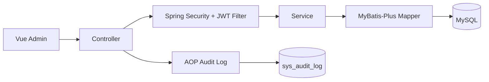
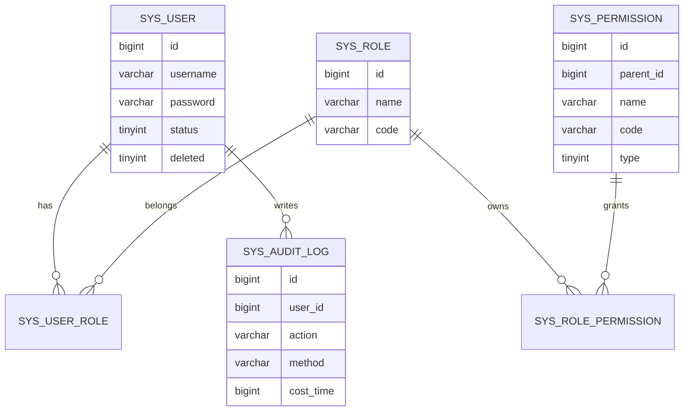
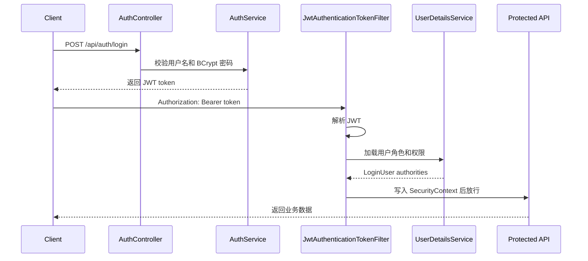

# 企业后台管理系统

一个基于 Spring Boot、Spring Security、JWT、MyBatis-Plus、Vue 的通用企业后台脚手架。当前仓库覆盖用户、角色、权限、批量授权、登录认证、接口鉴权和 AOP 审计日志，适合作为简历项目或业务后台底座继续扩展。

## 功能清单

- 统一响应体、全局异常处理、参数校验
- 用户/角色/权限分页查询与 CRUD
- BCrypt 密码加密、JWT 登录认证
- Spring Security 过滤器认证和 `@PreAuthorize` 方法级鉴权
- 用户角色、角色权限批量授权
- AOP 审计日志：记录用户、接口、参数脱敏、耗时、状态
- Vue 单页联调原型：登录、用户、角色、权限、授权
- SQL 初始化脚本和 Postman 集合

## 技术栈

- 后端：Spring Boot、Spring Security、MyBatis-Plus、MySQL、JWT、Spring AOP
- 前端：Vue 3、Vite、fetch
- 测试：JUnit 5

## 项目结构

```text
src/main/java/org/example/enterprisebacksystem
├── common       # 通用返回、异常、枚举、AOP、JWT 工具
├── config       # MyBatis-Plus、Spring Security 配置
├── controller   # REST API
├── domain       # 数据库实体
├── dto          # 请求/响应 DTO
├── mapper       # MyBatis-Plus Mapper
├── security     # LoginUser、JWT 过滤器、UserDetailsService
└── service      # 业务接口与实现
```

## 架构图



## ER 图



## 鉴权流程



## 快速启动

1. 创建并初始化数据库：

```bash
mysql -uroot -p < src/main/resources/sql/init.sql
```

2. 修改数据库配置：

```properties
spring.datasource.url=jdbc:mysql://localhost:3306/enterprise_db?useUnicode=true&characterEncoding=utf-8&serverTimezone=Asia/Shanghai&useSSL=false
spring.datasource.username=root
spring.datasource.password=你的密码
```

3. 启动后端：

```bash
./mvnw spring-boot:run
```

4. 启动前端：

```bash
cd frontend/my-admin-demo
npm install
npm run dev
```

默认账号：

```text
username: admin
password: 123456
```

## 常用接口

- `POST /api/auth/login`：登录，返回 token
- `POST /api/auth/register-test`：创建测试用户
- `GET /api/users?page=1&size=10`：用户分页
- `GET /api/roles?page=1&size=10`：角色分页
- `GET /api/permissions?page=1&size=10`：权限分页
- `POST /api/auth/users/{userId}/roles`：给用户批量分配角色
- `POST /api/auth/roles/{roleId}/permissions`：给角色批量分配权限

Postman 集合位于：

```text
docs/api/EnterpriseBackSystem.postman_collection.json
```

## Day6/Day7 交付状态

- Day6：已补分页请求基类、用户/角色/权限分页 DTO、批量授权接口、枚举校验和 5 个关键测试样例。
- Day7：已补 README 架构说明、ER 图、鉴权流程图、快速启动、SQL 初始化脚本和 Postman 集合。
